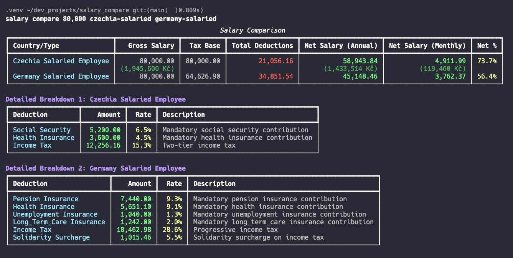
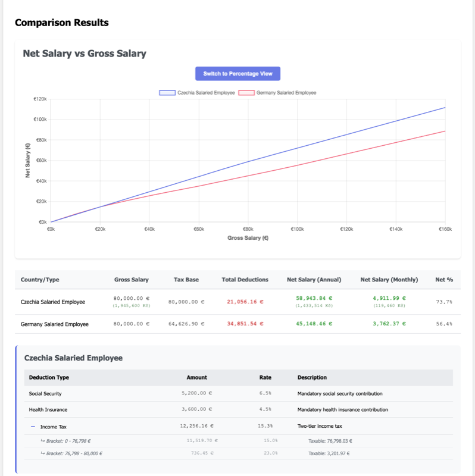

# Salary Compare

A command-line tool for calculating net salaries across different countries and employment types.

## Preview

### Console Output


### HTML Report with Interactive Charts


## Features

- Calculate net salary for various employment types (Salaried Employee, Freelancer)
- Support for multiple countries with accurate tax calculations
- **Dynamic currency conversion**: Automatically fetches current EUR/CZK exchange rates
- **Flexible salary input**: Supports comma-separated thousands (e.g., 100,000 or 100000)
- Detailed breakdown of deductions including:
  - Income Tax (with bracket calculations)
  - Social Security Tax
  - Health Insurance
  - Pension Contributions (where applicable)
- Multiple output formats: console table, HTML report, CSV export
- Interactive HTML reports with detailed calculation popups
- Comprehensive unit tests with mocked currency conversion for stability

## Supported Countries and Employment Types

### Western & Central Europe
- **Germany**: Salaried Employee (Tax Class 1)
- **Czechia**: Salaried Employee, Freelancer (60/40 rule)
- **Spain**: Salaried Employee in Madrid, Barcelona, Valencia (regional rates)

### Southern Europe
- **Portugal**: Salaried Employee, Freelancer (Simplified Regime with 75% deemed expenses)
- **Israel**: Salaried Employee

### Eastern Europe (Low-Tax Freelancer Havens)
- **Romania**: Freelancer (Microenterprise 1% revenue tax)
- **Bulgaria**: Freelancer (10% flat income tax)

## Installation

This project uses Poetry for dependency management.

```bash
# Install Poetry if you don't have it
curl -sSL https://install.python-poetry.org | python3 -

# Install dependencies and create virtual environment
poetry install

# Activate the virtual environment
poetry shell
```

## Usage

### Single Calculation
```bash
# Basic calculation
poetry run salary calculate czechia-freelancer 100000

# With comma-separated thousands
poetry run salary calculate czechia-freelancer 100,000

# Generate HTML report
poetry run salary calculate czechia-freelancer 100,000 -o HTML
```

### Comparison
```bash
# Compare different employment types with a single salary
poetry run salary compare 100,000 czechia-freelancer germany-salaried

# Compare low-tax freelancer regimes
poetry run salary compare 100,000 romania-freelancer-micro portugal-freelancer bulgaria-freelancer czechia-freelancer

# Compare Spanish regional rates
poetry run salary compare 100,000 spain-madrid spain-barcelona spain-valencia

# Compare multiple scenarios
poetry run salary compare 100,000 czechia-freelancer czechia-salaried germany-salaried

# Generate HTML comparison report
poetry run salary compare 75,500 czechia-freelancer germany-salaried -o HTML
```

### Output Formats
```bash
# Console output (default)
poetry run salary calculate czechia-freelancer 100000

# CSV export
poetry run salary calculate czechia-freelancer 100000 -o CSV

# HTML report
poetry run salary calculate czechia-freelancer 100000 -o HTML
```

### List Available Types
```bash
poetry run salary list-types
```

## Testing

The project includes comprehensive unit tests for all calculators. Tests are organized within each module:

```bash
# Run all tests
poetry run pytest

# Run specific calculator tests
poetry run pytest salary_compare/calculators/tests/test_germany.py -v
poetry run pytest salary_compare/calculators/tests/test_czechia.py -v

# Run tests with coverage
poetry run pytest --cov=salary_compare
```

### Test Structure
- `salary_compare/calculators/tests/` - Calculator-specific tests
  - `test_germany.py` - German salaried employee tests
  - `test_czechia.py` - Czechia salaried and freelancer tests
- `tests/conftest.py` - Pytest configuration with mocked currency conversion (1 EUR = 25 CZK)

### Currency Conversion
- **Live rates**: Uses exchangerate-api.com to fetch current EUR/CZK rates
- **Caching**: Rates are cached for 24 hours to reduce API calls
- **Fallback**: If API fails, uses approximate rate of 1 EUR = 25 CZK
- **Testing**: Tests use mocked conversion for predictable results

## Tax Calculation Details

### Germany (Salaried Employee)
- Progressive income tax rates (14%, 42%, 45%)
- Social security contributions: ~20% of gross income
- Health insurance: ~7.3% of gross income
- Pension insurance: ~9.3% of gross income

### Czechia (Salaried Employee)
- Flat income tax: 15% on income up to CZK 1,867,728, 23% above
- Social security: 6.5% of gross income
- Health insurance: 4.5% of gross income

### Czechia (Freelancer - 60/40 Rule)
- 60% of income considered expenses, 40% taxable
- Income tax: 15% on taxable income (40% of gross)
- Social security: 29.2% on 50% of gross income
- Health insurance: 13.5% on 50% of gross income

### Israel (Salaried Employee)
- Progressive income tax with 7 brackets (10% to 50%)
- National Insurance (Bituach Leumi): ~4%
- Health Tax (Mas Briut): ~5%
- Pension (Gemel Pensia): 6% employee contribution
- Keren Hishtalmut (Advanced Training Fund): 2.5% employee contribution
- Note: Employers also contribute to pension (6.5%) and Keren Hishtalmut (7.5%)
